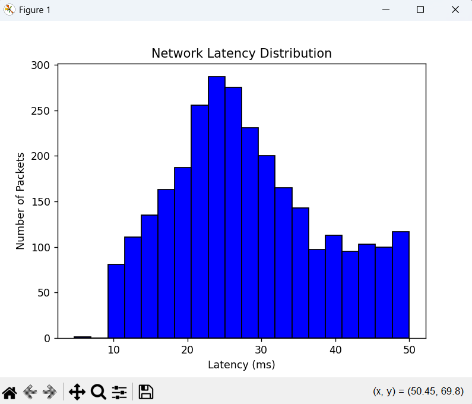

# Network Traffic Performance Analyzer

## Overview
The **Network Traffic Performance Analyzer** is a Python and SQL project designed to simulate and analyze network packet performance metrics. The system generates synthetic network traffic, stores results in a SQLite database, and computes key metrics such as latency, packet loss, and throughput. 

This project demonstrates full-stack data handling for network simulations, from automated data collection to visualization, and emphasizes reproducibility and modular design.

---

## Features
- Simulates network traffic and packet flows with configurable parameters  
- Stores traffic data in **SQLite** for structured analysis  
- Computes metrics including **average latency**, **packet loss**, and performance trends  
- Visualizes network performance using **Matplotlib** histograms and charts  
- Modular design for easy extension and integration with additional metrics

---

## Technologies Used
- **Languages:** Python, SQL  
- **Libraries & Tools:** NumPy, Pandas, Matplotlib, SQLite, VS Code  
- **Concepts:**  
  - Network traffic simulation  
  - Data collection and storage  
  - Performance analysis and visualization  
  - Modular and reusable code design  

--- 

## System Architecture
This project consists of two main modules:

- **Traffic Simulator**
  - Generates synthetic network packets with timestamps and latency  
  - Handles packet loss scenarios and timing for real-time simulation  

- **Analyzer**
  - Reads stored traffic data from SQLite  
  - Computes network metrics including average latency and packet loss rate  
  - Generates visualizations for packet latency distributions  

---

## Example Latency Distribution
